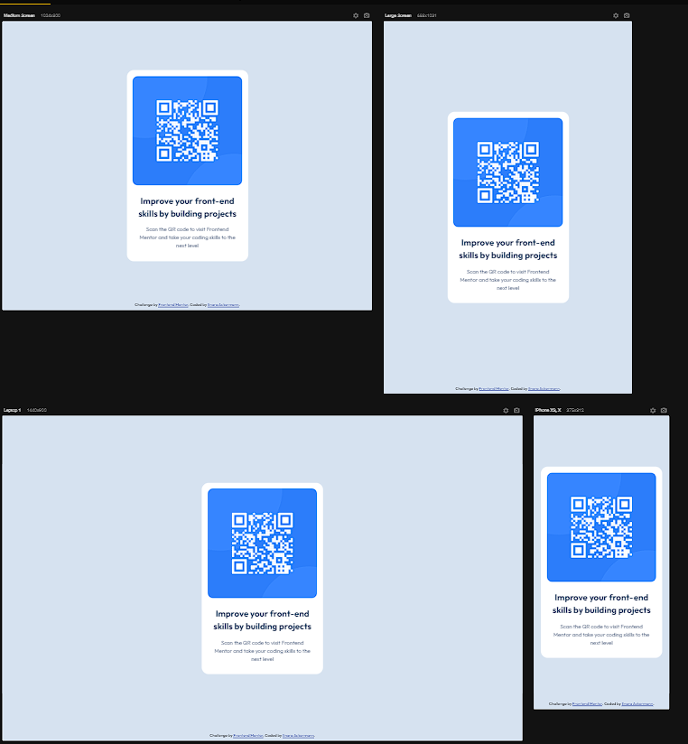

# Frontend Mentor - QR code component solution

This is a solution to the [QR code component challenge on Frontend Mentor](https://www.frontendmentor.io/challenges/qr-code-component-iux_sIO_H). Frontend Mentor challenges help you improve your coding skills by building realistic projects. 

## Table of contents

- [Overview](#overview)
  - [Screenshot](#screenshot)
  - [Links](#links)
- [My process](#my-process)
  - [Built with](#built-with)
  - [What I learned](#what-i-learned)
- [Author](#author)

## Overview

### Screenshot

### Links

- Solution URL: [Add solution URL here](https://github.com/IlnaraAckermann/qr-code-component-main)
- Live Site URL: [Add live site URL here](https://ilnaraackermann.github.io/qr-code-component-main/)

## My process

### Built with 

- Semantic HTML5 markup
- CSS custom properties

### What I learned 

Use HTML5 and CSS to compose a simple responsive layout

## Author 

- Frontend Mentor - [@ilnaraackermann](https://www.frontendmentor.io/profile/IlnaraAckermann)
- LinkdIn - [@ilnaraackermann](https://www.linkedin.com/in/ilnaraackermann)

